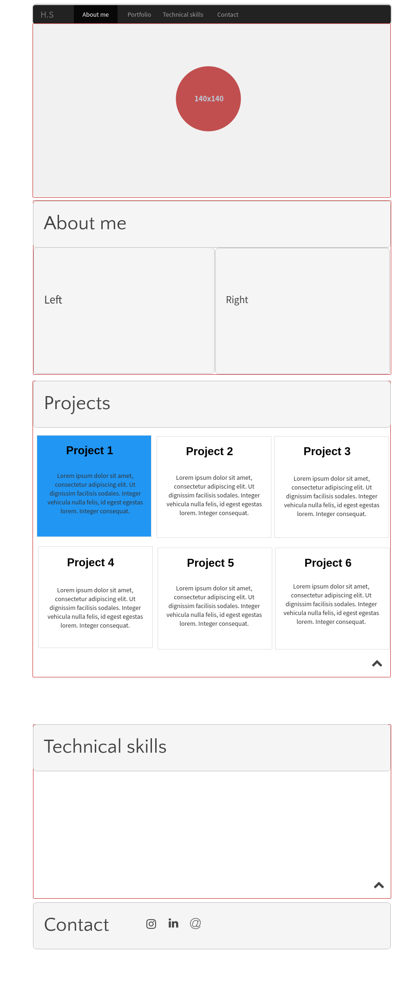

# E-portfolio

This project will be to create a portfolio that can be used to demonstrate projects I have worked on. The task set requires the project to be made using bootstrap and have a few section that could introduce me to potential visitors as well as demonstrate who I am.

This project does not currently use JavaScript or JQuery except in the navbar.

* Requirements
  * About me section
  * Projects section
  * Technical skills section
  * Contact section
  * Bootstrap
    * Grid-layout
    * Mobile first
    * Nav-bar
    * Google fonts
    * Glyphs
  * GitHub pages
  * Backgrounds

### TODO
  - [x] Wireframe
  - [x] Bootstrap
  - [x] Mobile First
  - [x] Nav bar
  - [x] Google Fonts
  - [x] Glyphs - Font awesome
  - [x] Backgrounds
  - [ ] README
  - [ ] Github Pages

### Future changes
  - [ ] Add content to the sections
  - [ ] Add Javascript for better design
  - [ ] use Css Animation

## Wireframe

Below is an initial design of the finished portfolio

### Mobile Version

### Desktop version

### Changes
I have decided to move the the small upwards chevron from the desktop version and only make it visible for mobile version of the portfolio.

The right panel in the "About me" section is now being used to show a portrait image of myself in the desktop. Whereas, the mobile version has the portrait being centred and at the top.
